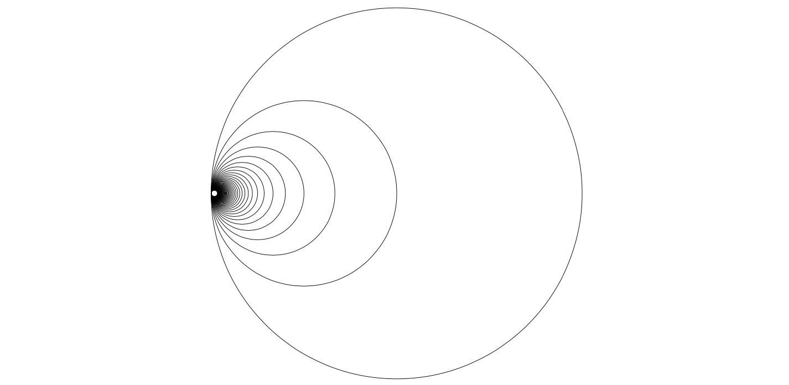

# Circle

::: tikzpy.drawing_objects.circle.Circle

## Examples
Here we create several circles, making use of the `action` parameter. 
```python
from tikzpy import TikzPicture

tikz = TikzPicture()
tikz.circle((0, 0), 1.25) #action="draw" by default
tikz.line((0, 0), (0, 1.25), options="dashed")
tikz.circle((3, 0), 1, options="thick, fill=red!60", action="filldraw")
tikz.circle((6, 0), 1.25, options="Green!50", action="fill")
tikz.show()
```


We can also use circles to create the [Hawaiian Earing](https://en.wikipedia.org/wiki/Hawaiian_earring).

```python
from tikzpy import TikzPicture

tikz = TikzPicture()

radius = 5
for i in range(1, 60):
    n = radius / i
    tikz.circle((n, 0), n)
tikz.show()
```


