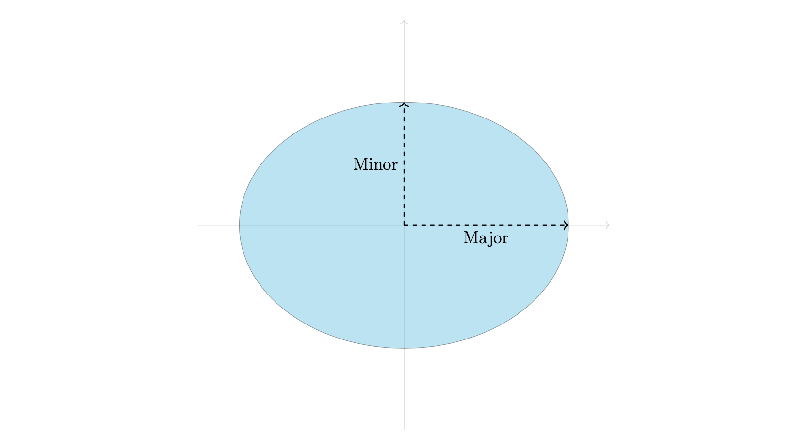

# Ellipse

::: tikzpy.drawing_objects.ellipse.Ellipse

## Example
Here we draw and ellipse and define the major and minors axes.
```python
import tikzpy

tikz = tikzpy.TikzPicture()

# x,y axes
tikz.line((-5, 0), (5, 0), options="Gray!40, ->")
tikz.line((0, -5), (0, 5), options="Gray!40, ->")
# Ellipse
ellipse = tikz.ellipse(
    (0, 0), 4, 3, options="fill=ProcessBlue!70, opacity=0.4", action="filldraw"
)
# Labels
h_line = tikz.line((0, 0), (ellipse.x_axis, 0), options="thick, dashed, ->")
v_line = tikz.line((0, 0), (0, ellipse.y_axis), options="thick, dashed, ->")
tikz.node(h_line.midpoint, options="below", text="Major")
tikz.node(v_line.midpoint, options="left", text="Minor")
```



