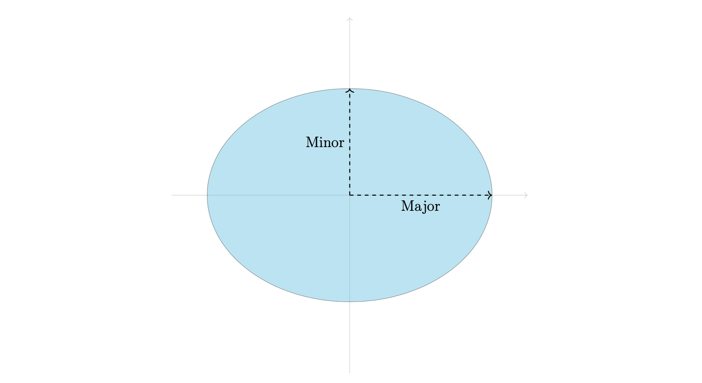

# `Ellipse`

The ellipse class handles ellipses in Tikz. It it analagous to the Tikz command 
```
\draw[options] <center> ellipse (<x_radius> and <y_radius>);
```
The signature of the class is given below.
```python
from tikzpy import Ellipse

ellipse = Ellipse(center, x_axis, y_axis, options, action)
```

| Parameter        | Description                                                                          | Default   |
| ---------------- | ------------------------------------------------------------------------------------ | --------- |
| `center` (tuple) | Pair of floats representing the center of the ellipse                                |
| `x_axis` (float) | The length (in cm) of the horizontal axis of the ellipse                             |
| `y_axis` (float) | The length (in cm) of the vertical axis of the ellipse                               |
| `action` (str)   | An action to perform with the ellipse (e.g., `\draw`, `\fill`, `\filldraw`, `\path`) | `"\draw"` |


## Example
Here we draw and ellipse and define the major and minors axes.
```python
import tikzpy

tikz = tikzpy.TikzPicture()

# x,y axes
tikz.line((-5, 0), (5, 0), options="Gray!40, ->")
tikz.line((0, -5), (0, 5), options="Gray!40, ->")
# Ellipse
ellipse = tikz.ellipse(
    (0, 0), 4, 3, options="fill=ProcessBlue!70, opacity=0.4", action="filldraw"
)
# Labels
h_line = tikz.line((0, 0), (ellipse.x_axis, 0), options="thick, dashed, ->")
v_line = tikz.line((0, 0), (0, ellipse.y_axis), options="thick, dashed, ->")
tikz.node(h_line.midpoint, options="below", text="Major")
tikz.node(v_line.midpoint, options="left", text="Minor")
```




## Methods
`Ellipse` has access to methods `.shift()`, `.scale()`, `.rotate()`, which behave as one would expect and takes in parameters as described before.


