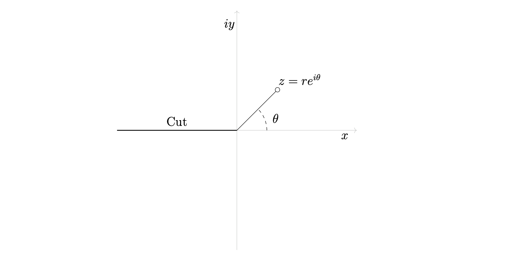

# `Node`

The `Node` class is an object that is used 
```python
from tikzpy import Node

node = Node(position, options, text)
```

| Parameter          | Description                                                                            | Default |
| ------------------ | -------------------------------------------------------------------------------------- | ------- |
| `position` (tuple) | A tuple (x, y) of floats representing the position of the node                         |
| `options` (str)    | String containing valid Tikz node options (e.g., "Above")                              | `""`    |
| `text` (str)       | A string containing content, such as text or LaTeX code, to be displayed with the node | `""`    |

## Examples
Here we use some nodes to label a figure explaining the logarithm branch cut
```python
import tikzpy

tikz = tikzpy.TikzPicture()
# x,y axes
tikz.line((-4, 0), (4, 0), options="Gray!40, ->")
tikz.line((0, -4), (0, 4), options="Gray!40, ->")
# Cut
tikz.line((-4, 0), (0, 0), options="thick")
# Line out
tikz.line((0, 0), (1.414, 1.414), options="-o")
tikz.arc((1, 0), 0, 45, radius=1, options="dashed")

# Labels
tikz.node((3.6, -0.2), text="$x$")
tikz.node((-0.24, 3.53), text="$iy$")
tikz.node((1.3, 0.4), text="$\\theta$")
tikz.node((2.1, 1.7), text="$z = re^{i\\theta}$")
tikz.node((-2, 0.3), text="Cut")
```
which produces


Here's another example of usings nodes to illustrate the concept of a multivariable function.
```python
import tikzpy

row_1 = tikzpy.TikzPicture()

# Lines and rectangles
row_1.line((0, 0), (2, 0), options="->")
row_1.rectangle((2, -0.5), (4, 0.5))
row_1.line((4, 0), (6, 0), options="->")
# Labels
row_1.node((-1.2, 0), text="$(x_1, \dots, x_n)$")
row_1.node((1, 0.3), text="input")
row_1.node((3, 0), text="$f$")
row_1.node((5, 0.3), text="output")
row_1.node((7.3, 0), text="$f(x_1, \dots, x_n)$")
```


## Methods

`Node` has access to methods `.shift()`, `.scale()`, `.rotate()`, which behave as one would expect and takes in parameters as described before.

