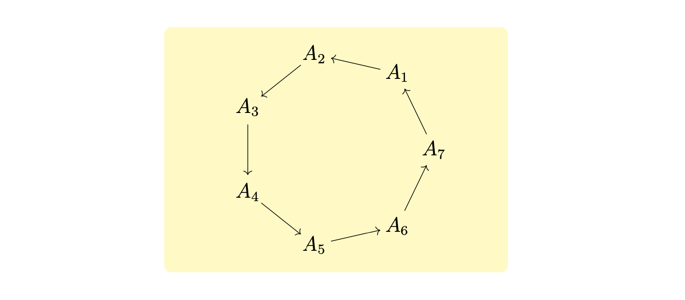

# `Rectangle`

The `Rectangle` class is used to handle rectangles in TikZ. It is analagous to the TikZ code 
```
\draw[<options>] <left_corner> rectangle <right_corner>;
```
The signature of the class is given below.
```python
from tikzpy import Rectangle

rectangle = Rectangle(left_corner, width, height, options="", action="\draw")
```

| Parameter              | Description                                                                            | Default   |
| ---------------------- | -------------------------------------------------------------------------------------- | --------- |
| `left_corner`  (tuple) | A tuple (x, y) of floats representing the position of the node.                        |
| `width` (float)        | Width of the rectangle                                                                 | `0`      |
| `height` (float)       | Height of the rectangle                                                                | `0`      |
| `options` (str)        | A string containing valid Tikz draw optins, (e.g, "fill = Blue").                      | `""`      |
| `action` (str)         | An action to perform with the rectangle (e.g., `\draw`, `\fill`, `\filldraw`, `\path`) | `"\draw"` |

## Example
Rectangles are often used as a background to many figures; in this case, 
we create a fancy colored background.

```python
import tikzpy

tikz = tikzpy.TikzPicture()

tikz.rectangle((-3.5, -2.5), (4.5, 2.5), options="rounded corners, Yellow!30",action="filldraw")
# Params
r = 2
n_nodes = 7
nodes = []
# Draw the nodes
for i in range(1, n_nodes + 1):
    angle = 2 * math.pi * i / n_nodes 
    x = r * math.cos(angle)
    y = r * math.sin(angle)
    node = tikz.node((x, y), text=f"$A_{{{i}}}$")
    nodes.append(node)

# Draw the lines between the nodes
for i in range(len(nodes)):
    start = nodes[i].position
    end = nodes[(i + 1) % len(nodes)].position
    tikz.line(start, end, options="->, shorten >= 10pt, shorten <=10pt")
```




## Methods
`Rectangle` has access to methods `.shift()`, `.scale()`, `.rotate()`, which behave as one would expect and takes in parameters as described before.

