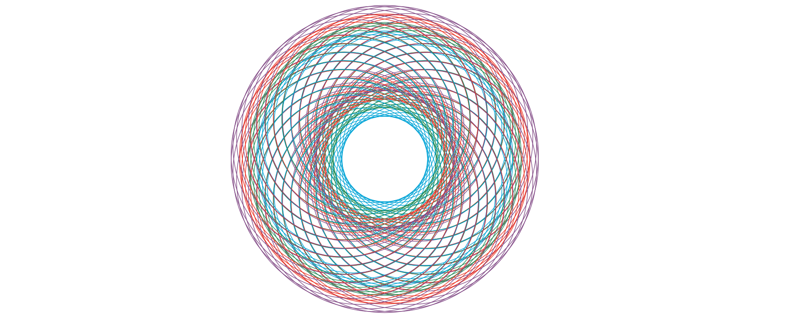
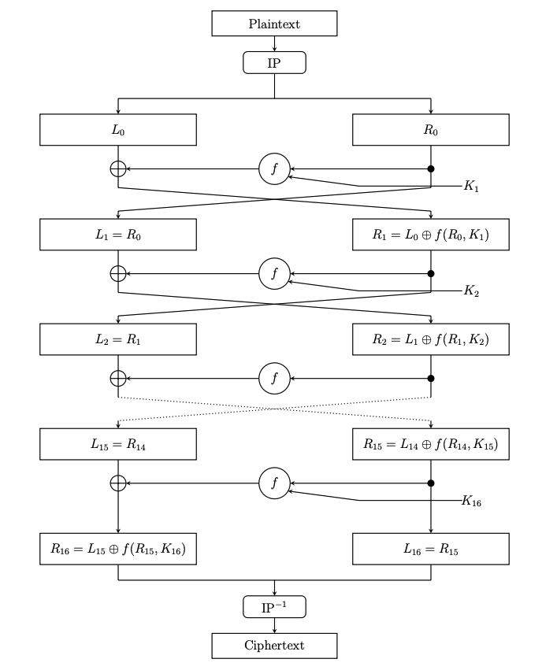
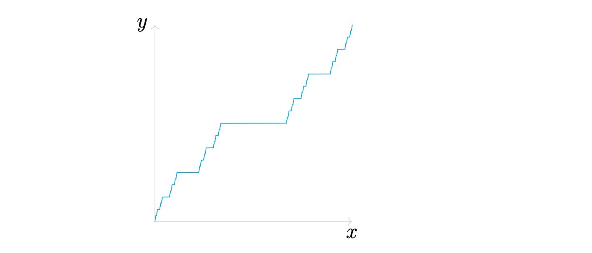
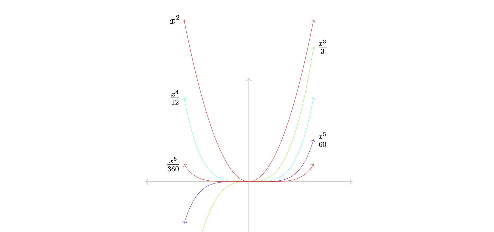
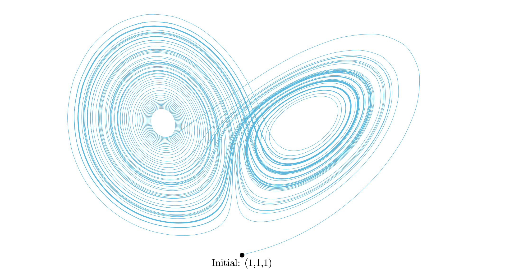
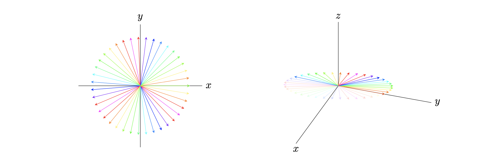
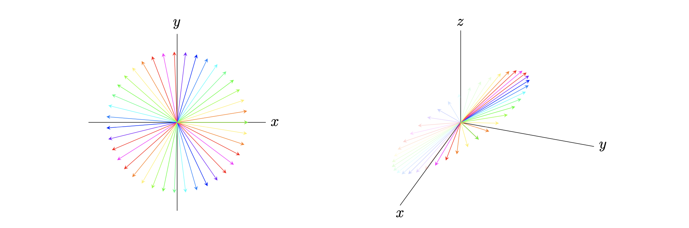
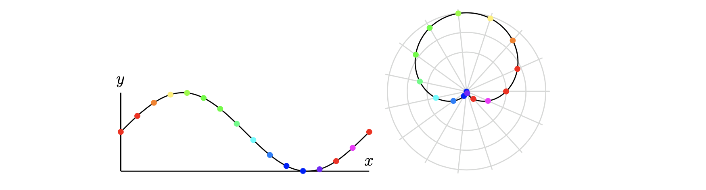

# Examples
### Line and two nodes
Suppose I want to create a line and two labels at the ends. The code below achieves this
```python
from tikzpy import TikzPicture

tikz = TikzPicture()
line = tikz.line((0, 0), (1, 1), options="thick, blue, o-o")
start_node = tikz.node(line.start, options="below", text="Start!")
end_node = tikz.node(line.end, options="above", text="End!")
tikz.show()
```
and produces

 

Saving the line as a variable `line` allows us to pass in `line.start` and `line.end` into the node positions, so we don't have to type out the exact coordinates. 
This is because lines, nodes, etc. are class instances with useful attributes: 
```python
>>> line.start
(0,0)
>>> line.end
(1,1)
>>> start_node.text
"Start!"
```

### Circles
In this example, we use a for loop to draw a pattern of circles. 

This example 
demonstates how Pythons `for` loop is a lot less messier than the `\foreach` loop provided in Tikz via TeX. (It is also more powerful; for example, Tikz with TeX alone guesses your step size, and hence it cannot effectively [loop over two different sequences at the same time](https://tex.stackexchange.com/questions/171426/increments-in-foreach-loop-with-two-variables-tikz)).

```python
import numpy as np
from tikzpy import TikzPicture

tikz = TikzPicture(center=True)

for i in np.linspace(0, 1, 30): # Grab 30 equidistant points in [0, 1]
    point = (np.sin(2 * np.pi * i), np.cos(2 * np.pi * i))

    # Create four circles of different radii with center located at point
    tikz.circle(point, 2, "ProcessBlue")
    tikz.circle(point, 2.2, "ForestGreen")
    tikz.circle(point, 2.4, "red")  # xcolor Red is very ugly
    tikz.circle(point, 2.6, "Purple")

tikz.show()
```
The above code then produces




### Roots of Unity 
In this example, we draw the 13 [roots of unity](https://en.wikipedia.org/wiki/Root_of_unity). 

If we wanted to normally do this in TeX, we'd
probably have to spend 30 minutes reading some manual about how TeX handles basic math. With Python, we can just use the `math` library and make intuitive computations to quickly build a function that displays the nth roots of unity.
```python
from math import pi, sin, cos
from tikzpy import TikzPicture

tikz = TikzPicture()
n = 13 # Let's see the 13 roots of unity
scale = 5

for i in range(n):
    theta = (2 * pi * i) / n
    x, y = scale * cos(theta), scale * sin(theta)
    content = f"$e^{{ (2 \cdot \pi \cdot {i})/ {n} }}$"

    # Draw line to nth root of unity
    tikz.line((0, 0), (x, y), options="-o")

    if 0 <= theta <= pi:
        node_option = "above"
    else:
        node_option = "below"

    # Label the nth root of unity
    tikz.node((x, y), options=node_option, text=content)

tikz.show()
```
Which generates: 


We will see in the examples that follow how imported Python libraries can alllow us to quickly (and efficiently, this is really important) make more sophisticated Tikz pictures. 

### Neural Network Connection

In this example, we illustrate the connection between two nodes in a neural network, and mathematically
annotate the diagram. Specifically, we're showing the weight connection node j to node i between
layers n-1 and n.

```python
from tikzpy import TikzPicture

tikz = TikzPicture(center=True) # center it in the PDF
radius = 0.25
pos_a = (0, 0)
pos_b = (4, 1)

# Draw the nodes
node_a = tikz.circle(pos_a, radius)
node_b = tikz.circle(pos_b, radius)

# Draw the line between the nodes
line = tikz.connect_circle_edges(node_a, node_b)
line.options = "->"

# Annotate the drawing with mathematical variables
h_j = tikz.node(node_a.center + (0.3, 0.75), text="$h_j^{(n-1)}$")
h_i = tikz.node(node_b.center + (0.3, 0.75), text="$h_i^{(n)}$")
w_ij = tikz.node(line.pos_at_t(0.5) + (0, 0.5), text="$w_{ij}^{(n)}$")

# Add ellipses on each side to illustrate more nodes are present
tikz.node(node_a.center + (0, 1.5), text="\\vdots")
tikz.node(node_a.center + (0, -0.75), text="\\vdots")
tikz.node(node_b.center + (0, 1.5), text="\\vdots")
tikz.node(node_b.center + (0, -0.75), text="\\vdots")
tikz.show()
```


### DES
In the [source here](https://github.com/ltrujello/Tikz-Python/blob/main/examples/des/des.py), we use a Python function to draw one round of the [DES function](https://en.wikipedia.org/wiki/Data_Encryption_Standard). We then call this function multiple times to illustrate the multiple rounds that entail the DES encryption algorithm.



### Transformer Architecture
In the [source here](https://github.com/ltrujello/Tikz-Python/blob/main/examples/transformer/pre_layer_transformer.py), we draw a diagram illustrating the Transformer architecture. This is very similar 
to the original diagram from Attention is All You Need. Note we also illustrate the Pre-Layer normalization technique that most implementations of the Transformer use. 


### General Ven Diagrams 
In the [source here](https://github.com/ltrujello/Tikz-Python/blob/main/examples/ven_diagrams/intersections_scope_clip.py), we use the python library `itertools.combinations` to create a function which takes in an arbitrary number of 2D Tikz figures and colors each and every single intersection. 

For example, suppose we arrange nine circles in a 3 x 3 grid. Plugging these nine circles in, we generate the image below.


As another example, we can create three different overlapping topological blobs and then plug them into the function to obtain


(Both examples are initialized in [the source](https://github.com/ltrujello/Tikz-Python/blob/main/examples/ven_diagrams/intersections_scope_clip.py) for testing.)
As one might guess, this function is useful for creating topological figures, as manually writing all of the `\scope` and `\clip` commands to create such images is pretty tedious.

### Barycentric subdivision
In [the source here](https://github.com/ltrujello/Tikz-Python/blob/main/examples/barycentric/barycentric.py), we create a function that allows us to generate the the n-th barycentric subdivision of a triangle. 


### Cantor function
In [the source here](https://github.com/ltrujello/Tikz-Python/blob/main/examples/cantor/cantor.py), we plot the Cantor function by performing recursion. It is clear from this [TeX Stackexchange question](https://tex.stackexchange.com/questions/241622/plotting-the-cantor-function) that TeX alone cannot do this, as most answers rely on external programs to generate the data. 



### Symbolic Intergation
In [the source here](https://github.com/ltrujello/Tikz-Python/blob/main/examples/symbolic_integration/integrate_and_plot.py), we use `numpy` and `sympy` to very simply perform symbolic integration. The result is a function which plots and labels the n-order integrals of any function. For example, the output of `x**2` (the polynomial x^2) generates the image below. 



### Cone over a Projective Variety
In [the source here](https://github.com/ltrujello/Tikz-Python/blob/main/examples/projective_cone/projective_cone.py), we use `numpy` to create an image which illustrates the concept of an affine cone over a projective variety. In the case of a curve Y in P^2, the cone C(Y) is a surface in A^3. 

The image that this drawing was modeled after appears in Exercise 2.10 of Hartshorne's Algebraic Geometry.


### Lorenz System
In [the source here](https://github.com/ltrujello/Tikz-Python/blob/main/examples/lorenz/lorenz.py), we use `numpy` and `scipy` to solve ODEs and plot the Lorenz system. This is made possible since `tikz_py` also supports 3D. 



### Tikz Styles
`tikzpy` supports the creation of any `\tikzset`, a feature of Tikz that saves users a great deal of time. You can save your tikz styles in a .py file instead of copying and pasting all the time. 

Even if you don't want to make such settings, there are useful `\tikzset` styles that are preloaded in `tikzpy`. One particular is the very popular tikzset authored by Paul Gaborit [in this TeX stackexchange question](https://tex.stackexchange.com/questions/3161/tikz-how-to-draw-an-arrow-in-the-middle-of-the-line). Using such settings, we create these pictures, which illustrate Cauchy's Residue Theorem.
[The source here](https://github.com/ltrujello/Tikz-Python/blob/main/examples/cauchy_residue_thm/cauchy_residue_thm.py) produces 


while [the source here](https://github.com/ltrujello/Tikz-Python/blob/main/examples/cauchy_residue_thm/cauchy_residue_thm_arc.py) produces 


### Linear Transformations
Recall a 3x2 matrix is a linear transformation from R^2 to R^3. Using such an interpretation, we create a function in [the source here](https://github.com/ltrujello/Tikz-Python/blob/main/examples/linear_transformations/linear_transformations.py) which plots the image of a 3x2 matrix. The input is in the form of a `numpy.array`. 

For example, plugging the array `np.array([[0, 1], [1, 1], [0, 1]])` into the source produces 



while plugging the array `np.array([[2, 0], [1, 1], [1, 1]])` into the source produces 



### Projecting R^1 onto S^1
In [the source here](https://github.com/ltrujello/Tikz-Python/blob/main/examples/spiral/spiral.py), we use `numpy` to illustrate the projection of R^1 onto S^1. Creating this figure in Tex alone is nontrivial, as one must create white space at self intersections to illustrate crossovers. Existing tikz solutions cannot take care of this, but the flexible logical operators of Python allow one to achieve it. 


### Polar Coordinates
In [the source here](https://github.com/ltrujello/Tikz-Python/blob/main/examples/polar/polar.py), we illustrate the concept of polar coordiantes by demonstrating how a sine curve is mapped into polar coordinates. This example should be compared to the more complex answers in this [TeX Stackexchange question](https://tex.stackexchange.com/questions/594231/make-rainbow-coloured-bullets-to-show-points) which seeks a similar result. 



### Blowup at a point
In [the source here](https://github.com/ltrujello/Tikz-Python/blob/main/examples/blowup/blowup.py), we illustrate the blowup of a point, a construction in algebraic geometry. This picture was created in 5 minutes and in half the lines of code compared to [this popular TeX stackexchange answer](https://tex.stackexchange.com/a/158762/195136), which uses quite convoluted, C-like Asymptote code.


