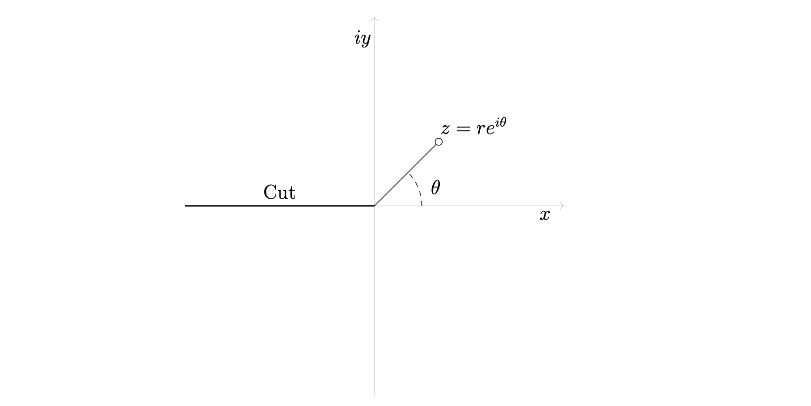
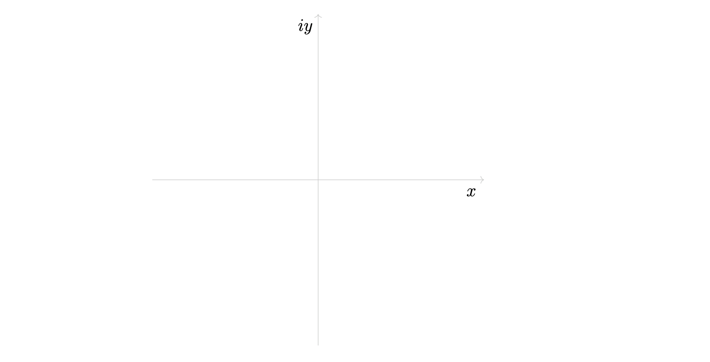
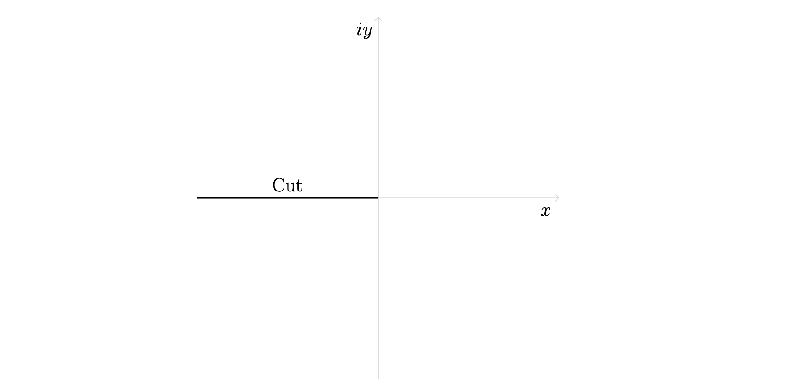
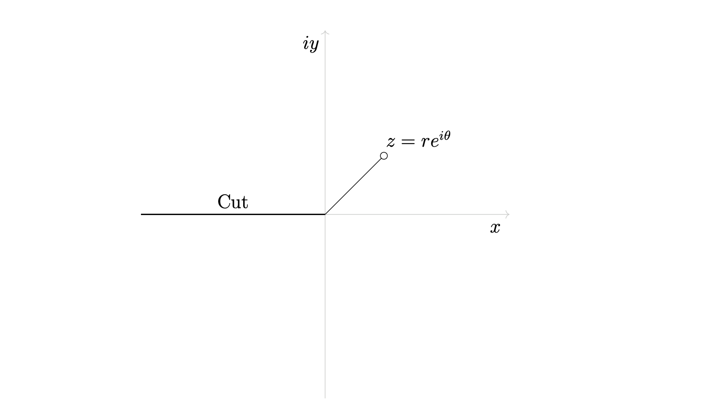
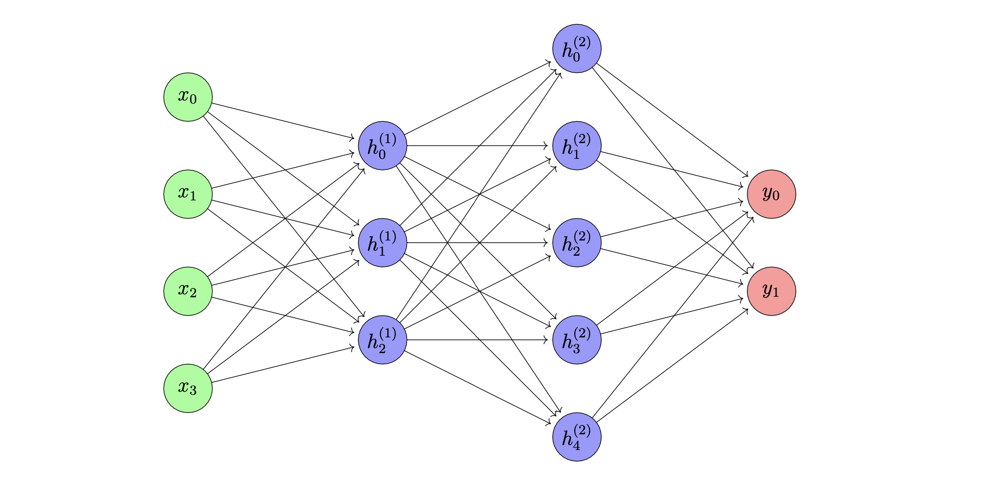
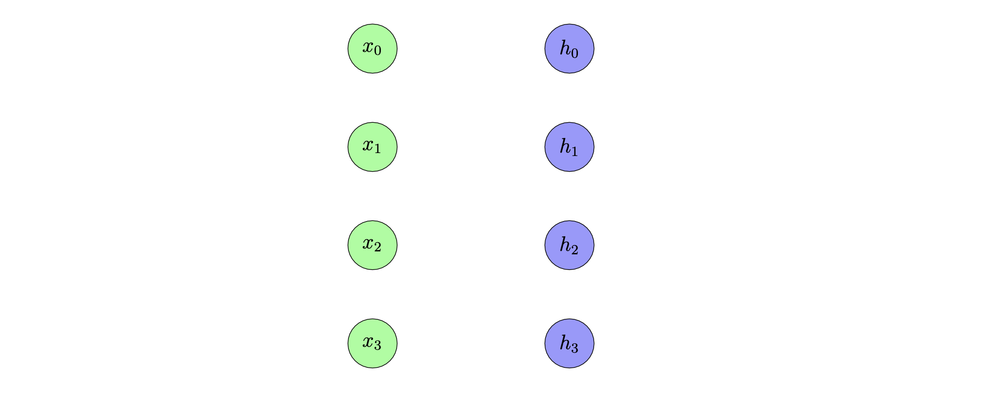
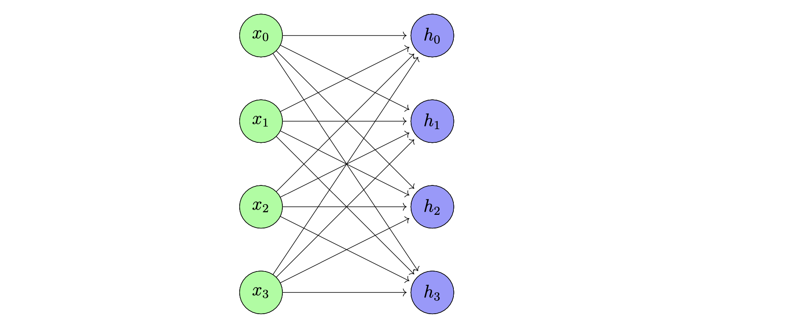
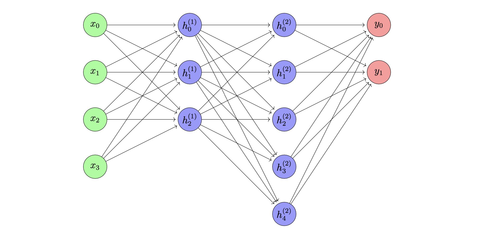
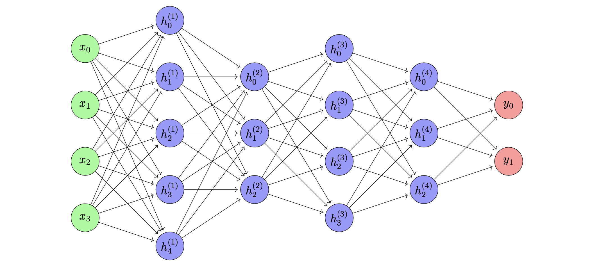

# Tutorials

This package is meant to have an extremely simple API that also resembles the creation of TikZ code very closely.
That is, we aim to minimize "surprises" such that users experienced with TikZ can easily use this package.
Towards that goal we offer step-by-step tutorials demonstrating this package.

## Line and a midpoint

Suppose we want to draw a line and a node positioned at the middle of the line.


According to the [TikZ docs](https://tikz.dev/tutorial-Euclid#sec-4.2.1), the way you would do this is with the TikZ code below.


```
\usetikzlibrary {calc}
\begin{tikzpicture}
  \coordinate [label=left:$A$]  (A) at (0,0);
  \coordinate [label=right:$B$] (B) at (1.25,0.25);
  \draw (A) -- (B);
  \node [fill=red,inner sep=1pt,label=below:$X$] (X) at ($ (A)!.5!(B) $) {};
\end{tikzpicture}
```

This is great, but it's also not really intuitive. The syntax `(X) at ($ (A)!.5!(B) $)` is kind of hard to understand and also later 
remember. Wouldn't it be nice if instead there was some kind of `midpoint` function that we could call on lines that we create? 

In tikz-python, we are able to write code that can draw this more intuitively. The code below also creates the diagram.

```python
from tikzpy import TikzPicture

# Define a canvas to draw on
tikz = TikzPicture(center=True)

# Draw a line
line = tikz.line((0,0), (1.25, 0.25))

# Draw the nodes
tikz.node(line.start, options="label=left:$A$")
tikz.node(line.end, options="label=right:$B$")
tikz.node(line.midpoint(), options="fill=red,inner sep=1pt,label=below:$X$")

# Display the drawing
tikz.show()
```

Here, `tikz.line` draws a line and it returns a Line object. `tikz.node` draws the nodes. The midpoint is calculated via the method `line.midpoint`. 
Also, note that we used the exact same options that were being used in TikZ. 

This is more intuitive. It's reasonable to define your graphics in terms of objects, and it's reasonable for a Line object to 
have a `.midpoint()` method, which should return the middle point of the line.
Overall, it's much easier to think about graphics as a collection of objects with different properties. 
However, a functional/object oriented approach is not possible in TikZ, so the code sometimes isn't intuitive.


## Logarithmic Branch Cut

Suppose we desire to create this diagram from mathematics, which illustrates the logarithmic branch cut.




### Axes

The first thing we can do is create the x and y axes. To do this, we can write the code as below.
```python
from tikzpy import TikzPicture

tikz = TikzPicture()
axes_len = 4

x_axis = tikz.line((-axes_len, 0), (axes_len, 0), options="Gray!40, ->")
y_axis = tikz.line((0, -axes_len), (0, axes_len), options="Gray!40, ->")
```
Here, we decide on an axis length, and we use this to create two perpendicular lines. 

Because of the way we wrote the code, if we change the axis length, we do not have 
to change the code controlling the lines.

### Labels

Next, we need to add the x-axis and y-axis labels. In TikZ, you would do this with a `\node` object. TikzPy implements 
node objects. For this example, we can do
```python
tikz.node(x_axis.end - (0.3, 0.3), text="$x$")
tikz.node(y_axis.end - (0.3, 0.3), text="$iy$")
```

Notice we are specifying the position of each node by accessing the `.end` attribute of each respective `Line` object, and then shifting it. This is possible because `Line` objects have `.start` and `.end` attributes that return coordinates. Thus, we are not hardcoding or guessing where to put the nodes. 

If we change the line (e.g. adjust its length), we do not have to change this code.

All together we now have this.

```python
from tikzpy import TikzPicture

tikz = TikzPicture()
axes_len = 4
# x,y axes
x_axis = tikz.line((-axes_len, 0), (axes_len, 0), options="Gray!40, ->")
y_axis = tikz.line((0, -axes_len), (0, axes_len), options="Gray!40, ->")
# axes labels
tikz.node(x_axis.end - (0.3, 0.3), text="$x$")
tikz.node(y_axis.end - (0.3, 0.3), text="$iy$")
tikz.show()
```

This code generates the graphic below. 



Again, because of the way we wrote the code, if we change the axis length, or even change the lines themselves, 
we do not have to do anything else; the nodes will move automatically. 

### Cut branch

Next, let's add the "Cut" branch. We achieve this with one `Line` object and one `Node` object to put in the word "Cut".

```python
# Cut branch
origin = (0, 0)
cut_line = tikz.line((-axes_len, 0), origin, options="thick")
tikz.node(cut_line.midpoint(), text="Cut", options="above")
```

The cut `Line` is dependent on `axes_len` value. The `Node` object is positioned via 
`Line.midpoint()`, a method which calculates the middle of the line. Thus, if we change the length of our line, we do not 
have to also change node's position. This saves us time. 

This so far generates 



### Line from origin

Next, let's add the line from the origin and annotate it. Again, we achieve this with a `Line` and a `Node` object. 

```python
# Line from origin
line = tikz.line(origin, (axes_len / 3, axes_len / 3), options="-o")
tikz.node(line.end + (0.7, 0), text="$z = re^{i\\theta}$", options="above")
```

In the code above, we draw 45-degree angled line from the origin to the point `(axes_len / 3, axes_len / 3)`. 
The denominator `3` is pretty arbitrary and subjective, and can be changed if the user likes. 
For our node, we use the `Line.end` attribute to specify the position and shift it to the right a bit by 0.7.
We then shift it up by specifying `options=above`, as one normally would in TikZ.

This then generates 



### Angle arc

Finally, we draw the dashed-angle. To achieve this we can use an `Arc` object and one `Node` object. 

```python
# Angle arc
from tikzpy import Point

arc_start = Point(1, 0)
tikz.arc(arc_start, 0, 45, radius=1, options="dashed")
tikz.node(arc_start + (0.3, 0.5), text="$\\theta$")
```

In the code above, we draw an arc starting at the point `arc_start` from angle 0 to 45. We define this point using 
the `Point` class instead of just a Python tuple. This is useful for when we create the node object, since we 
can specify the position of the node as `arc_start + (0.3, 0.5)`. 

All together, this generates the original image. The complete code is given below. 

```python
from tikzpy import TikzPicture, Point

tikz = TikzPicture(center=True)
axes_len = 4

# x,y axes
origin = (0, 0)
x_axis = tikz.line((-axes_len, 0), (axes_len, 0), options="Gray!40, ->")
y_axis = tikz.line((0, -axes_len), (0, axes_len), options="Gray!40, ->")
# axes labels
tikz.node(x_axis.end - (0.3, 0.3), text="$x$")
tikz.node(y_axis.end - (0.3, 0.3), text="$iy$")

# Cut branch
cut_line = tikz.line((-axes_len, 0), origin, options="thick")
tikz.node(cut_line.midpoint(), text="Cut", options="above")

# Line from origin
line = tikz.line(origin, (axes_len / 3, axes_len / 3), options="-o")
tikz.node(line.end + (0.7, 0), text="$z = re^{i\\theta}$", options="above")

# Angle arc
arc_start = Point(1, 0)
tikz.arc(arc_start, 0, 45, radius=1, options="dashed")
tikz.node(arc_start + (0.3, 0.5), text="$\\theta$")

tikz.show()
```


## Neural Networks

Let's use this package to draw the typical fully connected neural network architecture diagram. 

Our goal will be to draw this image via Python code that will be maintainable, readable, and modular.




### Drawing one layer

Firstly, we need to draw layers. We have input, hidden, and output layers to draw, but we'll first focus on the input layer. A given layer consists of a number of circles which are vertically stacked, each separated by some distance we'll call `node_sep`. These circles also have some color `color` and a mathematical symbol `symbol` inscribed. 

Thinking this through, we can use tikzpy's `Circle` class to draw the circles and the `Node` class to draw the mathematical symbols. The code below

```python
from tikzpy import TikzPicture, Point

node_radius = 0.5
node_sep = 2
symbol = "x"
color = "green"

tikz = TikzPicture(center=True)
for idx, _ in enumerate(range(4)):
    pos = (0, -node_sep * idx)
    # Draw the node
    tikz.circle(pos, radius=node_radius, options=f"fill={color}!40")
    # Draw the symbol
    tikz.node(pos, text=f"${symbol}_{idx}$")

tikz.show()
```

produces the image


Thus, we figured out how to draw layers. We can abstract the code above into a function that will then allow us to draw all of our input, hidden, and output layers.

```python
def network_layer(init_pos, num_nodes, symbol, color):
    layer_nodes = []
    for idx, _ in enumerate(range(num_nodes)):
        pos = Point(init_pos) + (0, -node_sep * idx)
        # Draw the circle
        circle = tikz.circle(pos, radius=node_radius, options=f"fill={color}!40")
        # Draw the node
        tikz.node(pos, text=f"${symbol}_{idx}$")
        layer_nodes.append(circle)
    return layer_nodes
```

In this function, we add an extra parameter `init_pos` that controls where to start drawing the network layer (necessary for when we start drawing multiple layers). We also collect the layers into a list `layer_nodes` and return it (necessary for when we draw arrows between layers). 

### Drawing many layers

With the function from earlier, we can now draw many layers. For instance, here's just the input layer and the next hidden layer. 

```python
from tikzpy import TikzPicture, Point

node_radius = 0.5
node_sep = 2
layer_sep = 3

input_layer_pos = (0, 0)
hidden_layer_pos = (layer_sep, 0)

tikz = TikzPicture(center=True)
network_layer(input_layer_pos, 4, "x", "green")
network_layer(hidden_layer_pos, 4, "h", "blue")
tikz.show()
```

The code above produces the image 



### Drawing connections

Next, we need to draw connections between these nodes. This is actually not too bad. 
This package has a method `connect_circle_edges` that can draw lines between two circles. Thus the code for this step is simply 

```python
def draw_layer_connection(curr_layer, next_layer):
    for curr_node in curr_layer:
        for next_node in next_layer:
            tikz.connect_circle_edges(curr_node, next_node, "->", dst_delta=0.1)
```

To see that this works, we can use this function as below 

```python

input_layer = network_layer(input_layer_pos, 4, "x", "green")
hidden_layer = network_layer(hidden_layer_pos, 4, "h", "blue")
draw_layer_connection(input_layer, hidden_layer)
```

to produce the image 



Note, it gets a bit crowded when we draw so many arrows on a single circle. This is why we use the `dst_delta` parameter of `connect_circle_edges`. It gives a little space between arrow tips and the circles that the arrows are pointing to.

### Drawing the fully connected network

We basically have everything we need to draw a fully connected network with variable layer sizes. 
Let's take a first stab at it by writing a function 
`draw_neural_network(layer_sizes)`. The parameter `layer_sizes` will be a list of integers, like 
`[4, 3, 5, 2]`, which will tell the code that the first layer has 4 nodes, second layer has 3 nodes, etc. 


Towards that goal, we produce this function. We loop over `layer_sizes`. In this loop, we have logic 
to control where to start drawing the layer, what to color it, what symbol to put inside of it.
After the loop, we then connect all the layers. 

```python 
def draw_neural_network(layer_sizes):
    layers = []
    init_pos = Point((0, 0))
    for idx, size in enumerate(layer_sizes):
        x_shift = idx * layer_sep
        pos = init_pos + (x_shift, 0)
        if idx == 0:
            symbol = "x"
            color = "green"
        elif idx == len(layer_sizes) - 1:
            symbol = "y"
            color = "red"
        else: 
            symbol = f"h^{{({idx})}}"
            color = "blue"

        nodes = network_layer(pos, size, symbol, color)
        layers.append(nodes)

    for idx, layer in enumerate(range(len(layers) - 1)):
        draw_layer_connection(layers[idx], layers[idx + 1])
```

Invoking this function as 
```python
tikz = TikzPicture(center=True)
draw_neural_network([4, 3, 5, 2])
tikz.show()
```

Then produces the image 



This is *almost* what we want but not quite. The layers aren't vertically centered. In fact, how much a layer 
should be vertically offset depends on the layer size itself, i.e. the number of nodes in the layer. Once you think about 
it for a second, you'll realize that the y-shift we need to invoke on a layer is given by a formula: If 
`max_size` is the largest layer size, `size` is the size of the layer we want to draw, and `node_sep` is the vertical distance 
between the nodes in the neural network, then

```
    y_shift = - (max_size - size) / 2 * node_sep
```
We can the modify our function by placing this computation for the y_shift inside, when drawing the layer.

```python
def draw_neural_network(layer_sizes):
    max_size = max(layer_sizes)
    layers = []
    init_pos = Point((0, 0))
    for idx, size in enumerate(layer_sizes):
        x_shift = idx * layer_sep
        y_shift = - (max_size - size) / 2 * node_sep
        pos = init_pos + (x_shift, y_shift)
        if idx == 0:
            symbol = "x"
            color = "green"
        elif idx == len(layer_sizes) - 1:
            symbol = "y"
            color = "red"
        else:
            symbol = f"h^{{({idx})}}"
            color = "blue"

        nodes = network_layer(pos, size, symbol, color)
        layers.append(nodes)

    for idx, layer in enumerate(range(len(layers) - 1)):
        draw_layer_connection(layers[idx], layers[idx + 1])
```

This completes the work. We can then call the function like so 

```python
tikz = TikzPicture(center=True)
draw_neural_network([4, 5, 3, 4, 3, 2])
tikz.show()
```

which will produce the image 




